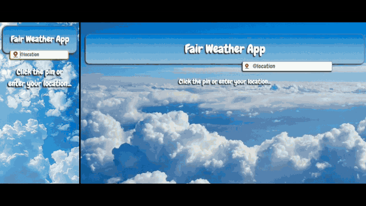

# Fair Weather App



## Summary  

Hosted: [Fair Weather App](https://fair-weather-app.netlify.app/)

The **Fair Weather App** is my weather companion project that goes beyond forecasts. It helps quickly decide if conditions are right for activities like **dog walking, motorcycle riding, or lawn mowing**, while giving a **visual and customizable experience**.  

I originally built this for personal use, but it’s grown into a **user-based platform** with:  
- **Customizable metrics** (choose units in °C/°F, miles/km, time ranges, and thresholds).  
- **User-uploaded images** triggered by weather conditions (rain, visibility, UV, etc).  
- **Authentication with Appwrite**, including signup, login, and password recovery.  
- **Default Dobermann-themed AI images** if you don’t upload your own.  
- **Responsive design**, with different layouts for desktop and mobile.  

It combines **WeatherAPI** for forecasts, **Appwrite** for auth, database and storage, and a **React + Vite frontend** for speed and responsiveness.  

---

## Requirements

- A free account on [weatherAPI.com](https://www.weatherapi.com/) for the API key.  
- An [Appwrite](https://appwrite.io/) project (Cloud or self-hosted) for auth, database and storage.  
  Run `npm run migrate:setup` to create the collections and bucket (needs the server `APPWRITE_*` values in `.env` — see `.env.example`).  

---

## Tech Stack & Dependencies

- **Frontend:** [React](https://react.dev/), [Vite](https://vitejs.dev/), [TypeScript](https://www.typescriptlang.org/)  
- **Mobile:** [Capacitor](https://capacitorjs.com/) Android wrapper (thin shell over the hosted site)  
- **Backend/Services:** [Appwrite](https://appwrite.io/) for auth, storage, and database  
- **API:** [WeatherAPI](https://www.weatherapi.com/)  
- **HTTP Client:** [axios](https://axios-http.com/)  
- **Date Handling:** [date-fns](https://date-fns.org/)  
- **UI Helpers:** [react-spinners](https://www.reactspinners.com/) for loaders  
- **Build & Quality:** ESLint, TypeScript, Vite  
- **Deployment:** Netlify with [@netlify/functions](https://docs.netlify.com/functions/overview/)  

---

## Setup & Installation

1. **Fork the Repository**  
   Click **Fork** in the top-right of this repo.  
   (See GitHub’s [guide](https://docs.github.com/en/pull-requests/collaborating-with-pull-requests/working-with-forks/fork-a-repo) if you’re new.)  

2. **Clone the Repository**  
    ```
    git clone git@github.com:your-username/fair-weather-app.git
    cd fair-weather-app
    ```

3. **Install Dependencies**
    ```
    npm install
    ```

4. **Environment Variables**
Copy `.env.example` to `.env` and fill it in:

    ```
    WEATHER_API=YOUR_WEATHER_API_KEY

    VITE_APPWRITE_ENDPOINT=https://fra.cloud.appwrite.io/v1
    VITE_APPWRITE_PROJECT_ID=YOUR_PROJECT_ID
    VITE_APPWRITE_DATABASE_ID=main
    VITE_APPWRITE_BUCKET_ID=images
    ```

5. **Run Locally**
    ```
    npm run dev
    ```

---

## Android app (Capacitor)

The repo also ships a [Capacitor](https://capacitorjs.com/) Android wrapper. It's a
thin native shell: the WebView loads the **live site**
(`server.url` in `capacitor.config.ts`), so weather (Netlify Functions) and auth
(Appwrite) work exactly as on the web. It needs a network connection — it isn't a
bundled offline app.

**Prerequisites**

- Android SDK with `platforms;android-35` and `build-tools;35.0.0`
- JDK 21 (Gradle 8.11 / AGP 8.7)
- `ANDROID_SDK_ROOT` set, or `android/local.properties` with `sdk.dir=...`

The manifest declares `ACCESS_COARSE_LOCATION` / `ACCESS_FINE_LOCATION` so the
"click the pin" `navigator.geolocation` call triggers the OS permission prompt;
grant it once and location search works.

**Build the APK**

```
npm run android:apk
```

Produces a debug-signed, sideloadable APK at `apk/fair-weather-app-debug.apk`
(the `apk/` folder is git-ignored). This is a debug build — not signed for the
Play Store.

**Install on a device**

```
npm run android:install        # USB device, via adb install -r
```

or copy `apk/fair-weather-app-debug.apk` onto the phone and open it (allow
"install from unknown sources").

**Other tasks**

- `npm run android:sync` — rebuild web assets and `cap sync` (run after web changes)
- `npm run android:icons` — regenerate launcher icon + splash from `resources/icon.png` / `resources/splash.png` (uses `@capacitor/assets`)
- App id: `com.blurryq.fairweather`. To point the shell at a local dev server, change `server.url` in `capacitor.config.ts` and re-sync.

## Features

- 🔑 **Authentication** – Signup, login, logout, and password reset

- ⚙️ **User Preferences** – Customize metrics, thresholds, and display hours

- 🎨 **Custom Uploads** – Add your own images for specific triggers (rain, UV, etc)

- 📱 **Responsive Design** – Different experiences for desktop and mobile

- ⏱️ **Performance** – Debounced searches and optimized API calls

## Challenges & Learnings

- **TypeScript Adoption**
My first project using TypeScript – I had to learn type annotations, interfaces, and strict type checking while still moving quickly.

- **From Static Prototype → User Platform**
It started as a hardcoded personal project, but expanding it to support auth, user preferences, and database storage meant redesigning state management and building a proper schema in Supabase.

- **Authentication & Database Integration**
Implementing secure signup/login with auto-provisioned rows for new users was a milestone. Adding “forgotten password” recovery gave me hands-on experience with Supabase Auth.

- **Custom File Uploads**
Letting users upload their own images for conditions like rain, fog, or high UV required learning how to handle file uploads in Supabase and dynamically render them in React.

- **Responsive Design & UX**
Providing different layouts for desktop and mobile was more than just CSS tweaks. Once I added user uploads and preferences, it became a real design challenge to keep both versions clean and usable.

- **Performance & API Usage**
To avoid hammering WeatherAPI, I implemented debounced search inputs and optimized fetches to balance responsiveness with efficiency.

- **Deployment Pipeline**
Making everything work with Vite, Netlify, serverless functions, and Supabase taught me a lot about environment variables, auth in production, and smooth deployment workflows.

## Future Improvements

- Toggle settings on or off

- Create your own AI images for custom triggers

- User profile with account settings

- Allow users to choose the amount of forecasted days (default 3)

- Multiple saved profiles/ themes (e.g., Dog Walking vs Motorcycle Riding)

- Notifications/reminders based on weather conditions